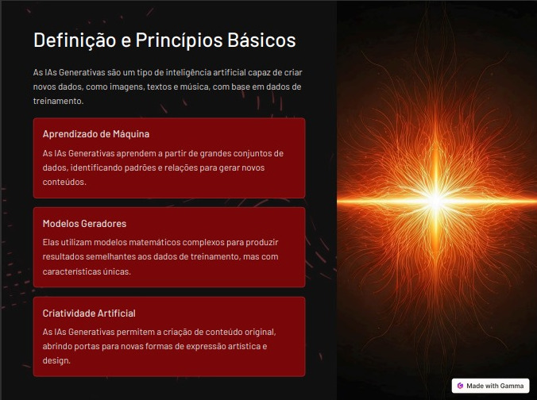
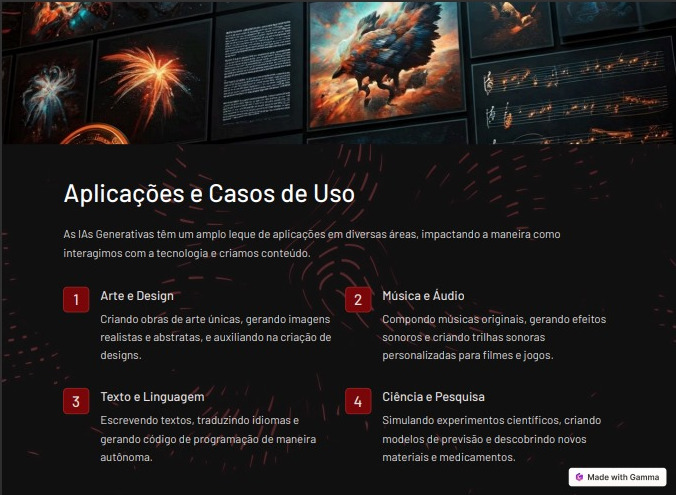
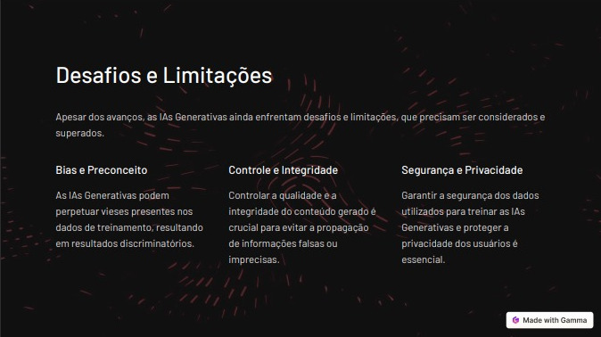
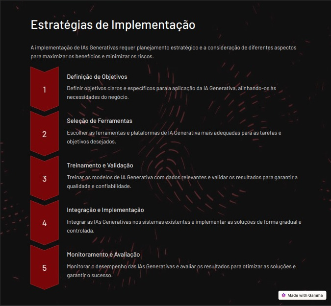

# GAMMA

**Gamma** é uma ferramenta alimentada por inteligência artificial que ajuda a criar apresentações, documentos e sites de forma rápida e fácil, sem a necessidade de habilidades de design ou codificação12. Ela oferece recursos avançados como reescrita automática de conteúdo, integração de imagens e vídeos, e layouts profissionais.

Todo o conteúdo foi gerado apenas passado o tema.

### [Voltar ao Readme principal](../README.md)