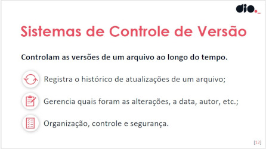
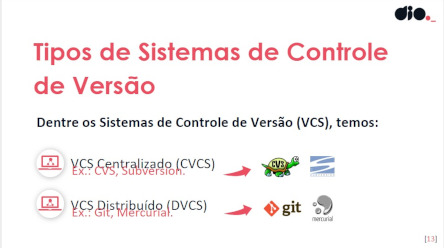
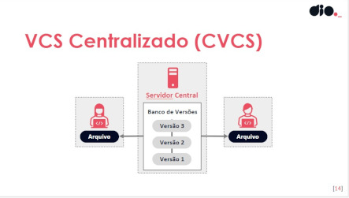
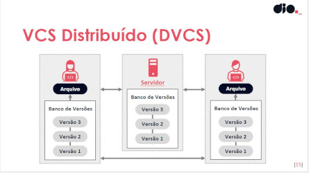
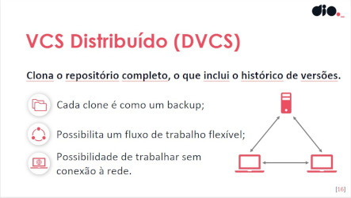

# O que é Versionamento de Código

  

**Versionamento de código** é o processo de acompanhar e gerenciar as alterações feitas em arquivos de código ao longo do tempo. Ele permite que desenvolvedores registrem cada modificação, mantenham um histórico das versões e colaborem de forma eficiente em projetos. Utilizando sistemas de controle de versão (como Git, SVN ou Mercurial), é possível criar ramificações para trabalhar em novas funcionalidades, reverter para versões anteriores quando necessário e evitar conflitos entre diferentes contribuições. Essa prática é essencial para garantir a integridade e a evolução do software.

## Sistemas de Controle de versão

  

**Sistemas de Controle de Versão (VCS)** são ferramentas que permitem gerenciar as mudanças em arquivos de código, mantendo um histórico das alterações e facilitando a colaboração entre desenvolvedores. Eles são essenciais para o desenvolvimento de software, pois ajudam a evitar conflitos e garantem que todos possam trabalhar juntos de forma eficiente.

  

## Os VCS podem ser classificados em dois tipos:

  

1. **Centralizado**: Nesse modelo, existe um repositório central onde todas as versões do código são armazenadas. Os desenvolvedores fazem check-out dos arquivos desse repositório e, ao finalizar suas mudanças, enviam-nas de volta para o servidor central. Um exemplo popular é o Subversion (SVN).

  

2. **Distribuído**: Neste modelo, cada desenvolvedor possui uma cópia completa do repositório em sua máquina local, incluindo todo o histórico de alterações. Isso permite que os desenvolvedores trabalhem offline e façam alterações sem afetar o repositório central até que estejam prontos para compartilhar. O Git é o exemplo mais conhecido desse tipo.

  

### [Voltar ao README principal](../README.md)

