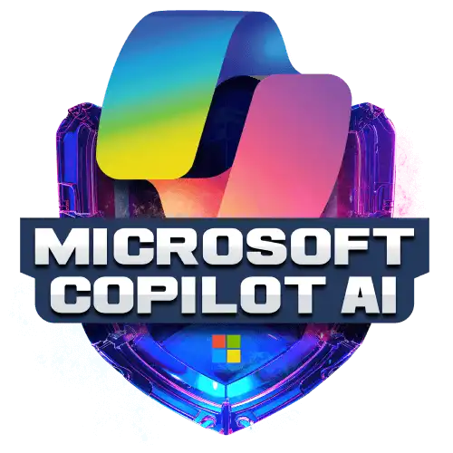

<h1 align="center">
     Microsoft Copilot AI 
    
</h1>

Bootcamp da **[DIO](https://www.dio.me/en)** em parceiria com a Microsoft, sobre AI Generativa! Neste curso, tivemos a oportunidade de explorar e dominar o uso do GitHub Copilot como seu assistente de programação em diversas situações, como pair programming, revisão de código e refactoring.

Além disso, descobrimos como personalizar o Microsoft Copilot para o Microsoft 365 utilizando o Microsoft Copilot Studio. Aprendrendo a adaptá-lo às suas necessidades específicas, tornando-o uma ferramenta ainda mais poderosa e eficiente para o seu fluxo de trabalho.

Por fim, mergulhando no mundo da AI Generativa. Aprendendo a criar e otimizar conteúdo de forma mais eficiente, aproveitando todo o potencial dessa tecnologia inovadora.

### Fundamentos de Inteligência Artificial(IA) e GitHub Copilit

- [Introdução](Fundamentos-IA/introducao-IA.md)

- [História da IA](Fundamentos-IA/historia-IA.md)

- [Questões Éticas](Fundamentos-IA/questoes-eticas.md)

- [Engenharia de Prompt](Fundamentos-IA/engenharia-prompt.md)

- [Git](Fundamentos-IA/git.md)

- [GitHub](Fundamentos-IA/github.md)

- [Versionamento de código](Fundamentos-IA/versionamento.md)

- [GitHub Copilot](Fundamentos-IA/github-copilot.md)

