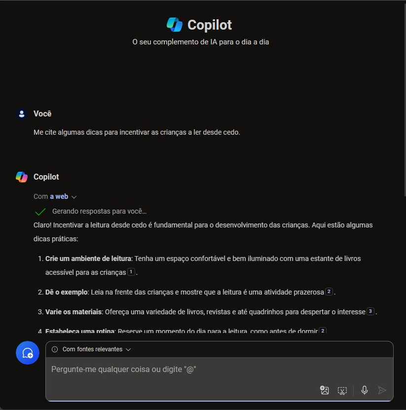
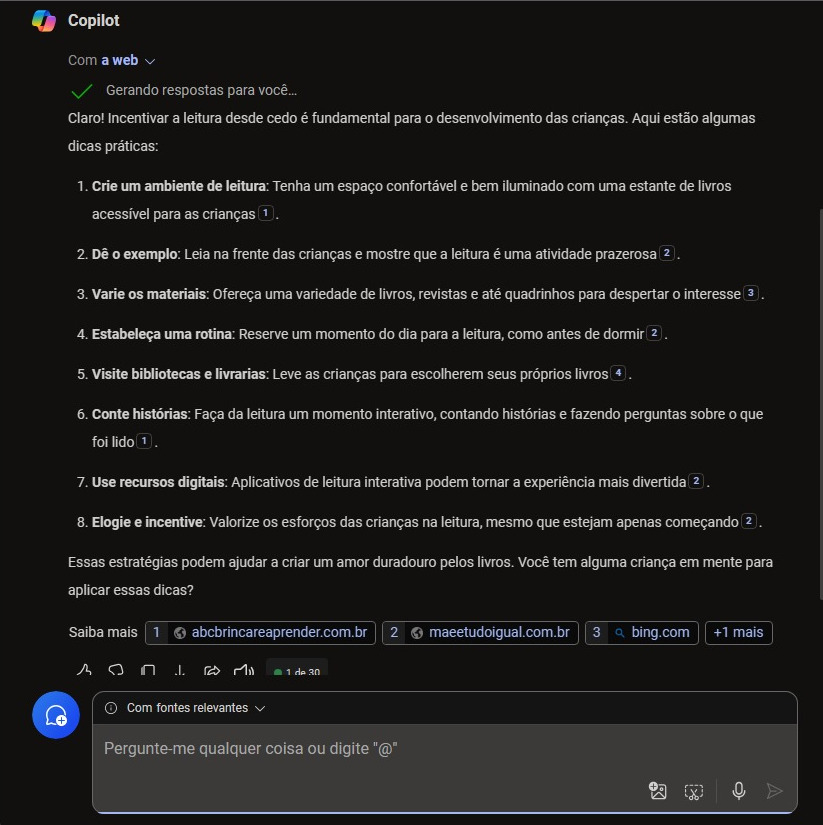
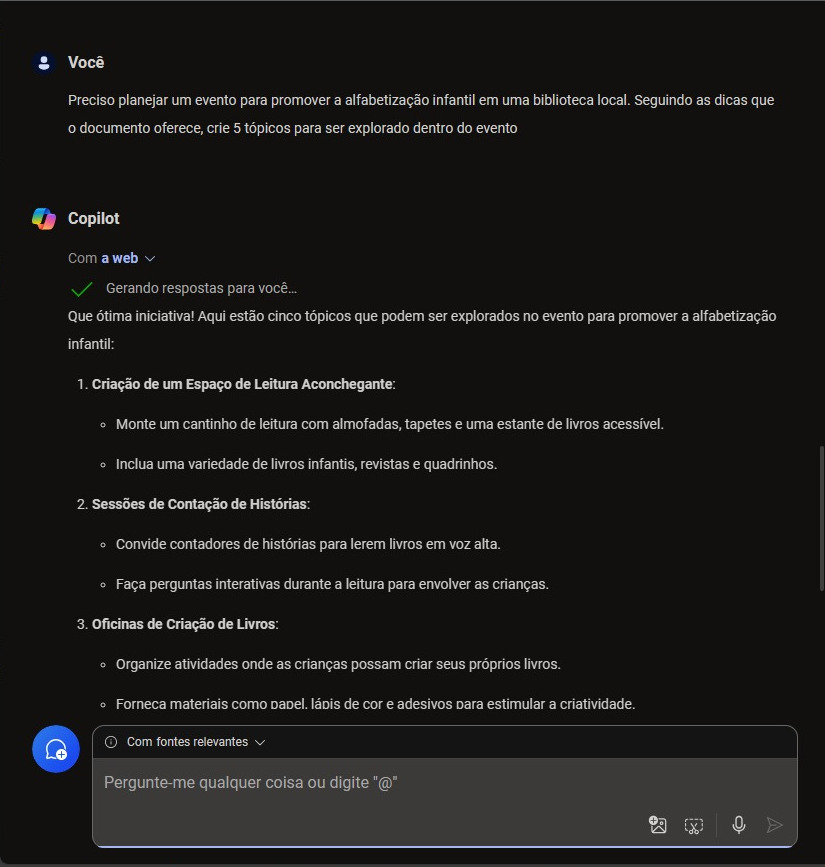
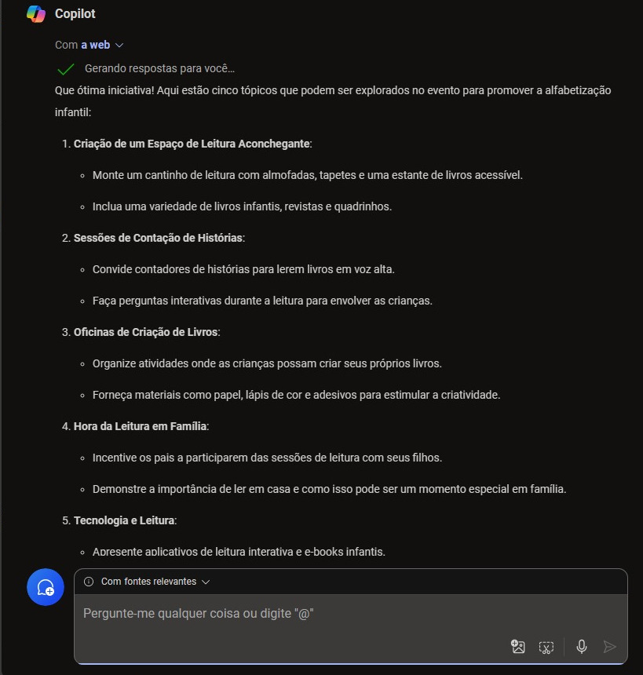
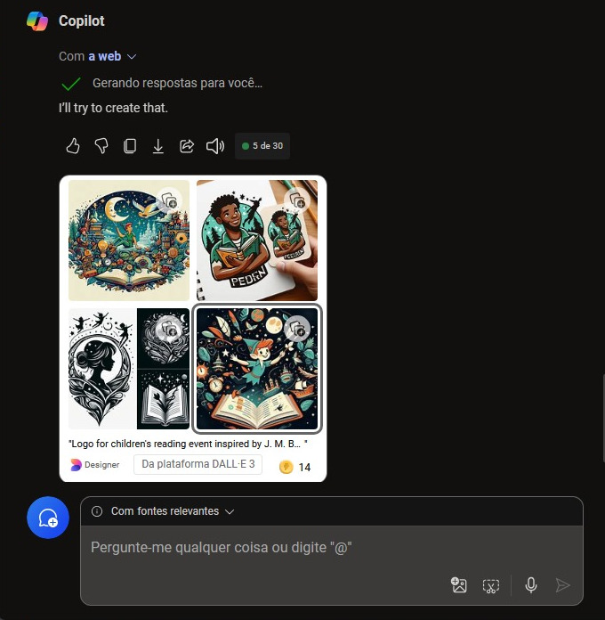
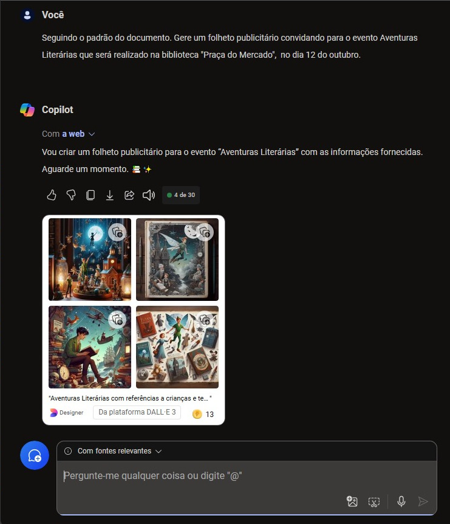
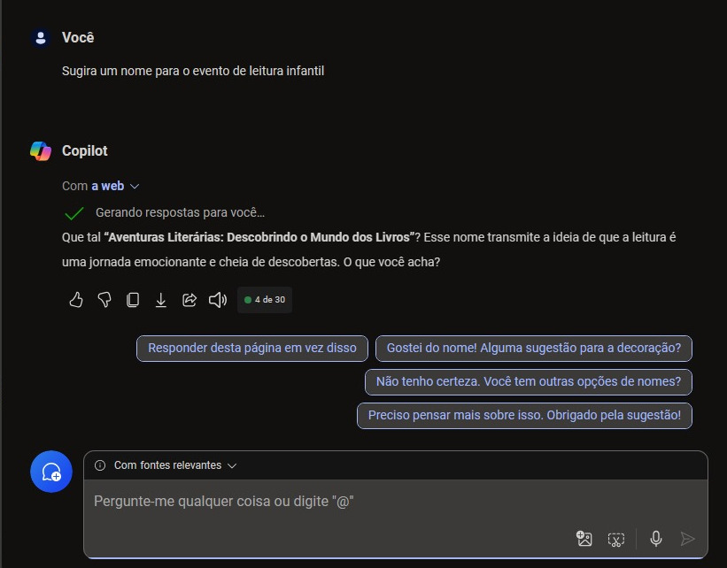
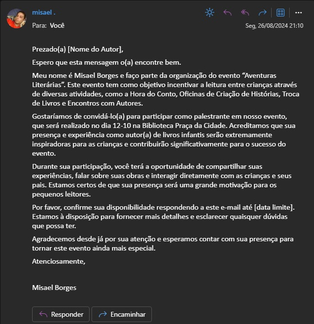
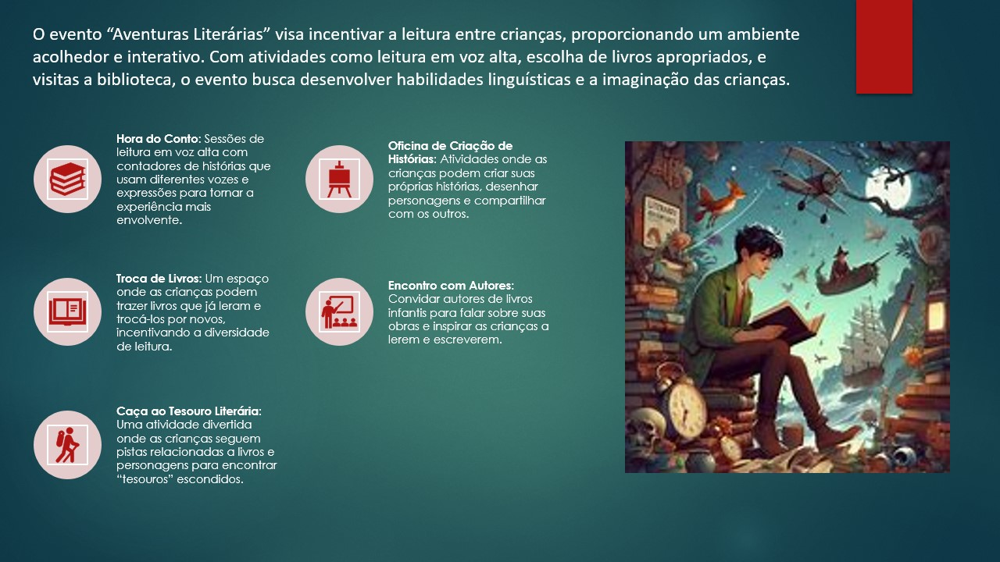

# Desafio Explorando os Recursos de IA Generativa com Copilot e OpenAI

## Descrição
O projeto "Explorando os Recursos de IA Generativa com Copilot" teve como objetivo planejar um evento inovador voltado para a promoção da alfabetização infantil. Utilizando as capacidades do Copilot, consegui gerar todo o conteúdo necessário para o evento, desde imagens atraentes até textos educativos e interativos. Essa experiência não apenas destacou a versatilidade da IA generativa, mas também evidenciou como a tecnologia pode ser uma aliada poderosa na produtividade.

O projeto ilustra a potencialidade do Copilot em criar conteúdos, praticamente do **ZERO**.

## Insights Aprendidos
- Aprendi que com o Copilot, basta uma ideia inicial, e todo o processo fui naturalmente.
- Me supreendi com a imensa gama de recursos que a ferramenta oferece.
- Mas o que mais me surpreendeu, e que pra mim foi novidade, foi a integração Copilot, OneDrive e Edge. Isso oferece uma gama imensa de ferramentas para o dia a dia.

## Prints do Processo
Alguns prints de como foi o processo:

## Convite para Palestrar no Evento “Aventuras Literárias”

## Divulgação

### [Voltar ao Readme principal](../README.md)

